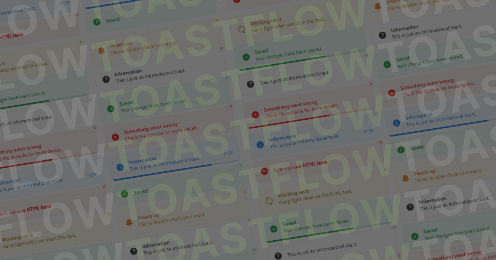

# Toastflow

Framework-agnostic toast engine with a Vue 3 renderer

## 📚 Documentation

- Docs: https://docs.toastflow.top/
- Comparisons (Vue toasts): https://docs.toastflow.top/comparisons/overview
- Playground: https://toastflow.top/
- Repository: https://github.com/adrianjanocko/toastflow

## 📦 Packages

- [`packages/vue`](packages/vue/README.md) - `vue-toastflow` package
- [`packages/core`](packages/core/README.md) - `toastflow-core` package
- [`packages/playground/vue`](packages/playground/vue) - local playground app
- [`packages/docs/vue`](packages/docs/vue) - docs source (VitePress)

## 📄 License

MIT - see [LICENSE](LICENSE)
