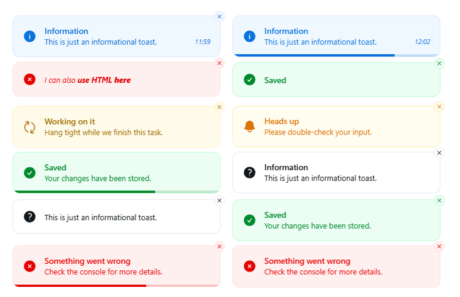

<!-- readme-top -->

<p align="center">
  
</p>

<h1 align="center">Toastflow</h1>
<p align="center">
  Framework-agnostic toast engine with a Vue 3 renderer. Typed core, smooth stack animations, CSS-first theming, and full control over layout and behavior.
</p>
<p align="center">
  <a href="#getting-started">Get started</a> &middot;
  <a href="#usage">Usage</a> &middot;
  <a href="#configuration">Configuration</a>
</p>

---

<details>
  <summary>Table of Contents</summary>
  <ol>
    <li><a href="#about-the-project">About the project</a></li>
    <li><a href="#preview">Preview</a></li>
    <li><a href="#packages">Packages</a></li>
    <li><a href="#built-with">Built with</a></li>
    <li>
      <a href="#usage">Usage</a>
      <ul>
        <li><a href="#quick-start">Quick start</a></li>
        <li><a href="#async-flows">Async flows</a></li>
        <li><a href="#html-content">HTML content</a></li>
        <li><a href="#headless-rendering">Headless rendering</a></li>
      </ul>
    </li>
    <li><a href="#configuration">Configuration</a></li>
    <li><a href="#theming">Theming</a></li>
    <li><a href="#events-and-store-access">Events and store access</a></li>
    <li><a href="#contributing">Contributing</a></li>
    <li><a href="#license">License</a></li>
  </ol>
</details>

## About the project

Toastflow is a headless toast engine with a Vue 3 renderer. It keeps toast state in a tiny framework-agnostic store so
you can render it your way while keeping predictable behaviors.

- Deterministic rules for duplicates, timers, pause-on-hover, close-on-click, and clear-all.
- CSS-first theming: swap the look by editing a handful of variables.
- Works inside components or in plain TS/JS modules and services.
- Headless slot to render your own card while reusing the store logic.

## Preview

<p align="center">
  
</p>

## Packages

- [toastflow-core](packages/core): typed, framework-agnostic toast store.
- [vue-toastflow](packages/vue): Vue 3 renderer with `<ToastContainer />`, a global `toast` helper, defaults, and icons.
- [playground-vue](packages/playground/vue): Vite + Vue demo playground for manual testing.

## Built with


## Usage (Vue.js 3 Composition API)

### Quick start

```ts
// main.ts
import {createApp} from "vue";
import App from "./App.vue";
import {createToastflow, ToastContainer} from "vue-toastflow";

const app = createApp(App);

app.use(
    createToastflow({
        // optional global defaults
        position: "top-right",
        duration: 5000,
    }),
);

// register globally or import locally where you render it
app.component("ToastContainer", ToastContainer);

// call toast.* only after the plugin is installed
app.mount("#app");
```

Render a container and fire toasts anywhere:

```vue
<!-- App.vue -->
<template>
  <ToastContainer/>
  <RouterView/>
</template>
```

```ts
import {toast} from "vue-toastflow";

toast.success({title: "Saved", description: "Your changes are live."});
toast.warning({description: "Low balance"});

const id = toast.error({title: "Oops", description: "Check console."});
toast.update(id, {description: "Fixed. All good now."});
toast.dismiss(id);
```

### Async flows

```ts
const run = toast.loading(
    () => fetch("/api/save").then((r) => r.json()),
    {
        loading: {title: "Saving", description: "Hang tight."},
        success: (data) => ({
            title: "Saved",
            description: `Stored item ${data.id}.`,
        }),
        error: (err) => ({
            title: "Error",
            description: err instanceof Error ? err.message : "Please try again.",
        }),
    },
);

await run;
console.log(run.toastId);
```

### HTML content

```ts
toast.info({
    title: "<strong>New version</strong>",
    description: "Release notes are <a href='/changelog'>here</a>.",
    supportHtml: true,
});
```

### Headless rendering

```vue

<ToastContainer
    v-slot="{
    toast,
    dismiss,
    bumpAnimationClass,
    clearAllAnimationClass,
    updateAnimationClass,
  }"
>
  <div
      class="my-toast"
      :class="[
      toast.type,
      bumpAnimationClass,
      toast.phase === 'clear-all' && clearAllAnimationClass,
      updateAnimationClass
    ]"
      @click="toast.closeOnClick && dismiss(toast.id)"
  >
    <header>
      <strong>{{ toast.title }}</strong>
      <button @click.stop="dismiss(toast.id)">x</button>
    </header>
    <p v-if="toast.description">{{ toast.description }}</p>
    <small v-if="toast.showCreatedAt">
      Sent at {{ toast.createdAtFormatter(toast.createdAt) }}
    </small>
  </div>
</ToastContainer>
```

## Configuration

Pass any [types.ts](packages/core/src/types.ts) fields to `createToastflow`; per-toast options override them:

- `position`: "top-right" (default), "top-left", "top-center", "bottom-*"
- `duration`: `5000` ms by default; `Infinity` or `0` disables auto-dismiss (progress bar auto-hides when disabled)
- `maxVisible`: `5` per stack; eviction respects `order`
- `order`: "newest" (default) or "oldest" per stack
- `preventDuplicates`: `false` by default; matches by position + type + title + description
- `progressBar`, `pauseOnHover`, `pauseStrategy` ("resume" | "reset")
- `animation`: class names for enter/leave/move (`name`), bump, clearAll, update (defaults use `Toastflow__*`)
- `closeButton` (`true`), `closeOnClick` (`false`)
- `offset` (`16px`), `gap` (`8px`), `width` (`350px`), `zIndex` (`9999`)
- `supportHtml`: `false` (opt-in)
- `showCreatedAt` and `createdAtFormatter` for timestamps
- lifecycle hooks: `onMount`, `onUnmount`, `onClick`, `onClose`

## Theming

- CSS variables live in [styles.css](packages/vue/src/styles.css) and are auto-imported with the Vue package.
- Key
  variables: `--tf-toast-bg`, `--tf-toast-color`, `--tf-toast-border-color`, `--tf-toast-radius`, `--tf-toast-padding`, `--tf-toast-icon-size`, `--tf-toast-progress-height`,
  plus per-type colors like `--success-bg` and `--error-text`.
- Animations are pure CSS class names; override them via the `animation` config or by redefining the `Toastflow__*`
  keyframes. **Animations are implemented using [TransitionGroup](https://vuejs.org/guide/built-ins/transition-group).**

## Events and store access

- `toast.subscribeEvents(listener)` gets `duplicate`, `timer-reset`, and `update` events.
- `toast.getState()` returns the current snapshot; helper
  methods: `toast.show`, `toast.success`, `toast.error`, `toast.warning`, `toast.info`, `toast.loading`, `toast.update`, `toast.dismiss`, `toast.dismissAll`, `toast.pause`, `toast.resume`, `toast.getConfig`.

## Contributing

Contributions are welcome! Fork the repo, create a branch, and open a PR. For bigger changes, open an issue first.

1. Fork the project
2. Create your branch
3. Commit your changes
4. Push to the branch
5. Open a Pull Request

## License

MIT - see [LICENSE](LICENSE).
