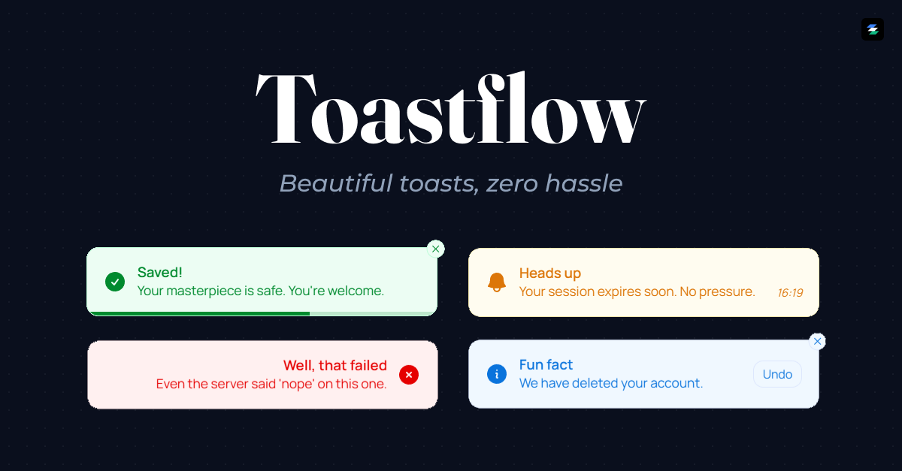

<p align="center">
  
</p>

<h1 align="center">🔔 Toastflow</h1>

<p align="center">
  <strong>Framework-agnostic toast engine</strong> with Vue 3 renderer and Nuxt module support.<br />
  Typed core · smooth stack animations · CSS-first theming · full layout control.
</p>

<p align="center">
  <a href="https://www.npmjs.com/package/vue-toastflow"></a>
  <a href="https://www.npmjs.com/package/nuxt-toastflow"></a>
  <a href="https://www.npmjs.com/package/toastflow-core"></a>
  <a href="LICENSE"></a>
</p>

<p align="center">
  <a href="https://docs.toastflow.top/">📖 Docs</a> · <a href="https://toastflow.top/">🎮 Playground</a> · <a href="https://docs.toastflow.top/comparisons/overview">⚔️ Comparisons</a>
</p>

---

## 📦 Packages

| Package                              |                                                                  Version                                                                  | Description                                            |
| :----------------------------------- | :---------------------------------------------------------------------------------------------------------------------------------------: | :----------------------------------------------------- |
| 🟢 [`vue-toastflow`](packages/vue)   |  [](https://www.npmjs.com/package/vue-toastflow)  | Vue 3 plugin — components, programmatic API, styles    |
| 💚 [`nuxt-toastflow`](packages/nuxt) | [](https://www.npmjs.com/package/nuxt-toastflow) | Nuxt module — auto-imports, SSR, zero config           |
| ⚙️ [`toastflow-core`](packages/core) |  [](https://www.npmjs.com/package/toastflow-core)   | Framework-agnostic core — store, timers, queue, events |

## 🚀 Quick Start

<table>
<tr>
<td width="50%">

**Vue 3**

```bash
pnpm add vue-toastflow
```

```ts
import { createToastflow } from "vue-toastflow";

createApp(App).use(createToastflow()).mount("#app");
```

</td>
<td width="50%">

**Nuxt**

```bash
pnpm add nuxt-toastflow
```

```ts
export default defineNuxtConfig({
  modules: ["nuxt-toastflow"],
});
```

</td>
</tr>
</table>

> 💡 Check the [Getting Started](https://docs.toastflow.top/guide/getting-started) guide for full setup with examples.

## ✨ Highlights

- 🎯 **Typed from core to UI** — full TypeScript, no `any`
- 🎨 **CSS-first theming** — override CSS variables, no JS config needed
- 📚 **Queue & stack management** — `maxVisible`, auto-queue, smooth animations
- ⏱️ **Timer controls** — pause on hover, progress bars, loading toasts
- 🧩 **Composable architecture** — slots, events, headless mode
- 🔌 **Framework-agnostic core** — bring your own renderer

## 🏗️ Development

```bash
pnpm install        # 📥 install all dependencies
pnpm build          # 🔨 build all packages
pnpm test           # 🧪 run all tests
pnpm lint           # 🔍 lint
pnpm format         # 💅 format with Prettier
```

## 🗂️ Monorepo Structure

```
toastflow/
├── 📦 packages/
│   ├── 🟢 vue/           → vue-toastflow
│   ├── 💚 nuxt/          → nuxt-toastflow
│   ├── ⚙️ core/          → toastflow-core
│   ├── 📖 docs/vue/      → VitePress docs
│   ├── 🎮 playground/vue → local playground app
│   └── 🧪 test/nuxt/     → Nuxt smoke test
└── 🖼️ assets/            → shared assets
```

## 📄 License

[MIT](LICENSE) — made with ❤️ by [@adrianjanocko](https://github.com/adrianjanocko)
